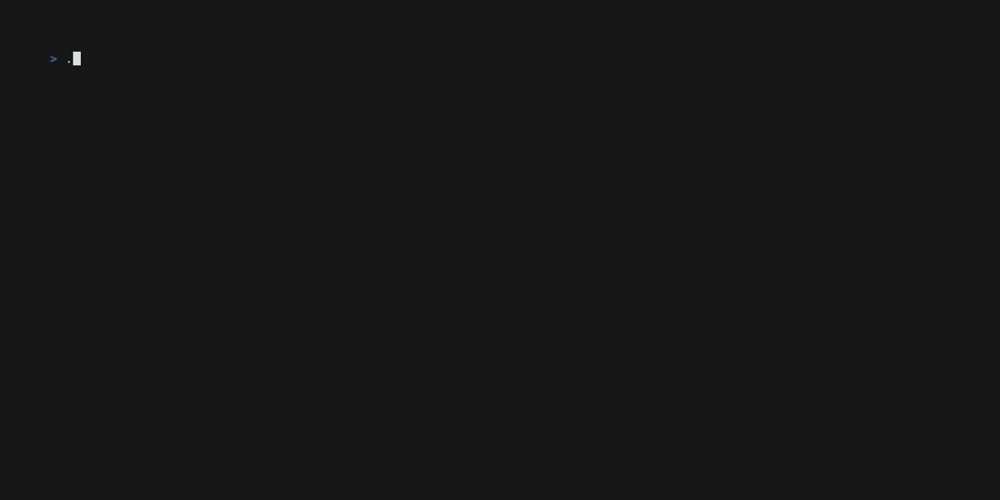
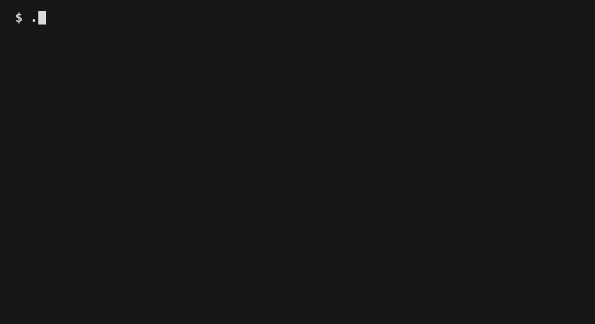
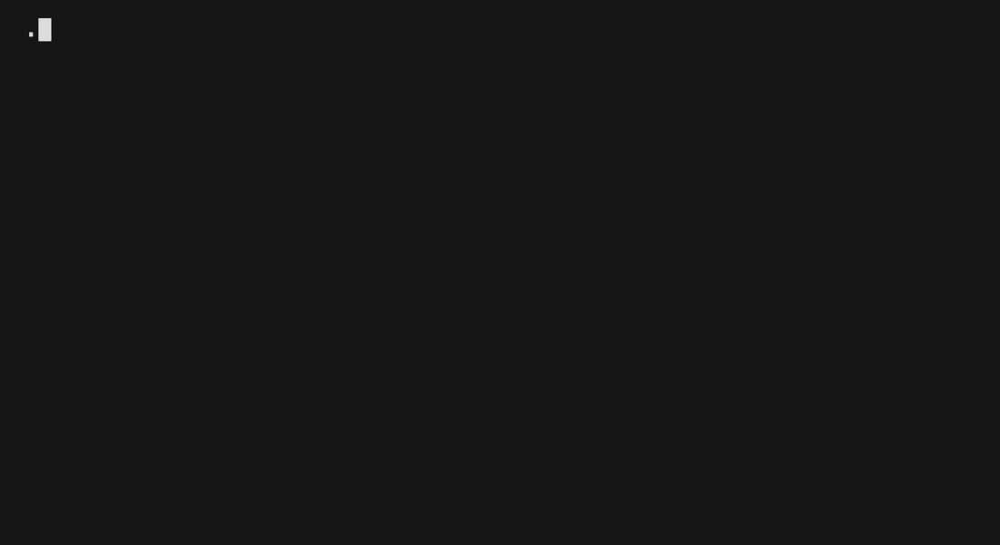

# Feature Demos

Terminal recordings using [VHS](https://github.com/charmbracelet/vhs). Record them yourself:

```bash
bash scripts/dev/install-vhs.sh
for tape in demos/*.tape; do vhs "$tape"; done
```

## Chat — Streaming + Markdown

Streaming responses with full markdown rendering: tables, code blocks with syntax highlighting, bold, links.



## File I/O — Read, Write, Edit

The LLM reads files, writes new files, and makes targeted `str_replace` edits with diff preview.


## Agents — Personas + Themes

Switch personality and permissions at runtime. Each agent has its own system prompt and tool access.



## Smart Routing — Auto Model Selection

Automatically selects the best model based on prompt complexity. Simple questions go to fast models, complex tasks to large ones.


## Web Search — Real-Time Information

Local SearXNG integration for up-to-date information without cloud APIs.



## Vision — Image Attachment

Attach images for multimodal models. Supports PNG, JPEG, and other formats.


## Command Execution

Run shell commands inline (`!cmd` for output, `!!cmd` for LLM context). The LLM can also propose commands via annotations.

## Spinners

23 random 1-char spinner styles selected per session — braille, circles, arrows, triangles, kiro fill, and more.

## Persistence

Save and load conversations with `/chat save` and `/chat load`. Model and host selection persisted to `.env`.
