# ADR-003: Development Workflow

## Status
Accepted

## Date
2026-04-10

## Context
We need a structured way of working that ensures quality from idea to release. Features should be well-thought-out before code is written, and thoroughly tested before merging.

This workflow combines proven practices: define before build (V-model), tests before code (TDD), document decisions (ADRs), and no waste (Lean).

## Decision
We follow this workflow for every feature:

```mermaid
graph LR
    subgraph "Left side — Define"
        A[1. Value discussion] --> B[2. Options analysis]
        B --> C[3. Decision + ADR]
        C --> D[4. Design + diagrams]
        D --> E[5. Write tests]
    end

    subgraph "Bottom — Build"
        E --> F[6. Implement]
    end

    subgraph "Right side — Verify"
        F --> G[7. Unit test]
        G --> H[8. Integration test]
        H --> I[9. E2E test]
        I --> J[10. Regression test]
    end

    subgraph "Release"
        J --> K[11. Local checks]
        K --> L[12. Update docs]
        L --> M[13. Refactor if needed]
        M --> N[14. PR + merge]
        N --> O[15. Release]
    end
```

### Phases

| # | Phase | Output |
|---|-------|--------|
| 1 | **Value discussion** | Why does this feature matter? What problem does it solve? |
| 2 | **Options analysis** | What are the possible approaches? Pros/cons of each |
| 3 | **Decision + ADR** | Pick one, document rationale in `docs/adr-xxx-*.md` |
| 4 | **Design** | Mermaid diagrams in docs (sequence, class, flowchart) |
| 5 | **Write tests** | TDD — tests first, based on the design |
| 6 | **Implement** | Minimal code to make tests pass |
| 7 | **Unit test** | Verify individual components |
| 8 | **Integration test** | Verify components work together |
| 9 | **E2E test** | Verify full user flow |
| 10 | **Regression test** | Verify nothing else broke |
| 11 | **Local checks** | `make test && make check` |
| 12 | **Update docs** | README, docs/README.md, ADRs |
| 13 | **Refactor** | Clean up if needed, re-run tests |
| 14 | **PR + merge** | Feature branch → PR → CI green → merge |
| 15 | **Release** | Version bump, tag, changelog (TBD) |

## Rationale
- **Left side first**: thinking before coding prevents wasted effort
- **TDD**: tests define the contract before implementation
- **Right side mirrors left**: each verification level corresponds to a definition level
- **Discipline over speed**: this is a code-flex — structure matters

## Influences
- [V-model](https://en.wikipedia.org/wiki/V-model) — define left, verify right
- [TDD](https://en.wikipedia.org/wiki/Test-driven_development) — tests before code (Kent Beck)
- [ADRs](https://adr.github.io/) — document decisions (Michael Nygard)
- [Lean](https://en.wikipedia.org/wiki/Lean_software_development) — no waste, only what adds value

## Consequences
- Features take longer to start but are higher quality
- Every feature has documentation before code exists
- Test coverage grows naturally with every feature
- Release process still needs to be defined (ADR to follow)
