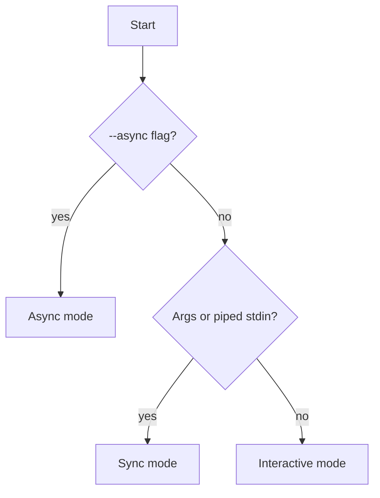

# ADR-005: Execution Modes

*Status*: Accepted · *Date*: 2026-04-10 · *Context*: The application needs to serve different use cases — interactive chat, scripting/piping, and background batch processing. A single mode is insufficient.

## Decision
Three execution modes are supported:

| Mode | Trigger | Behavior |
|------|---------|----------|
| **Interactive** | No args, TTY detected | REPL loop, streaming responses |
| **Sync** | Positional arg or piped stdin | Print response to stdout, exit |
| **Async** | `--async` flag | Fire-and-forget, write result to file |

### Detection logic



### Examples

```bash
# Interactive — chat session
./llama-cli

# Sync — one-shot, scriptable
./llama-cli "explain this error"
cat main.cpp | ./llama-cli "review this code"
./llama-cli "generate a Makefile" > Makefile

# Async — background, write to file
./llama-cli --async -o review.md "review this codebase"
```

## Rationale
- **Interactive** is the primary user-facing mode for daily use
- **Sync** enables piping and scripting — maximum AI integration with existing unix tools
- **Async** enables heavy tasks without blocking the terminal, and local batch processing as an alternative when cloud AI policies restrict usage
- Mode detection is implicit (TTY/args) with an explicit override (`--async`) — no unnecessary flags for common cases

## Consequences
- TTY detection is needed (`isatty(STDIN_FILENO)`)
- Async mode requires background process management and file output
- Interactive mode requires a REPL loop with line editing
- Sync and async modes share the same prompt execution logic, only output differs
