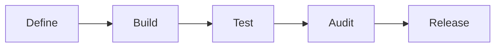
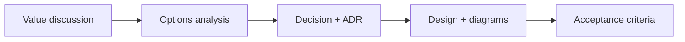
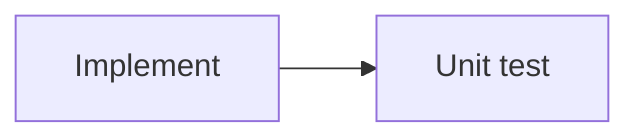
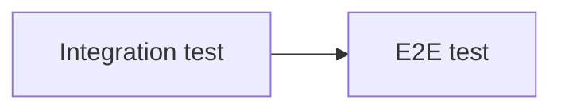
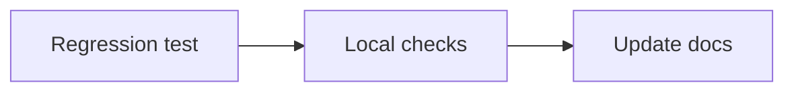
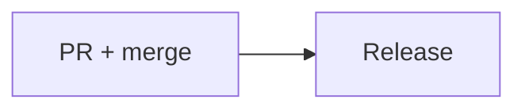

# ADR-003: Development Workflow

*Status*: Accepted · *Date*: 2026-04-10 · *Context*: A structured way of working is needed to ensure quality from idea to release. This workflow combines proven practices: define before build (V-model), tests before code (TDD), document decisions (ADRs), and no waste (Lean).

## Decision

The following workflow is followed for every feature:

### Level 1 — Overview

### Level 2 — Define

### Level 2 — Build

### Level 2 — Test

### Level 2 — Audit

### Level 2 — Release

### Phases

| # | Phase | Step | Output |
|---|-------|------|--------|
| 1 | **Define** | Value discussion | Why does this feature matter? What problem is solved? |
| 2 | | Options analysis | What are the possible approaches? Pros/cons of each |
| 3 | | Decision + ADR | One option is picked, rationale is documented in `docs/adr-xxx-*.md` |
| 4 | | Design | Mermaid diagrams are added to docs (sequence, class, flowchart) |
| 5 | | Acceptance criteria | What must be true for this feature to be considered done |
| 6 | **Build** | Implement | Minimal code is written to make tests pass |
| 7 | | Unit test | Individual components are verified |
| 8 | **Test** | Integration test | Components are verified to work together |
| 9 | | E2E test | The full user flow is verified |
| 10 | **Audit** | Regression test | Nothing else is broken |
| 11 | | Local checks | `make test && make check` are run |
| 12 | | Update docs | README, docs/README.md, ADRs are updated |
| 13 | **Release** | PR + merge | Feature branch → PR → CI green → merge |
| 14 | | Release | Version is bumped, tag and changelog are created (TBD) |

## Rationale

- **Left side first**: thinking before coding prevents wasted effort
- **TDD**: tests define the contract before implementation
- **Right side mirrors left**: each verification level corresponds to a definition level
- **Discipline over speed**: structure matters — this is a code-flex

## Influences

- [V-model](https://en.wikipedia.org/wiki/V-model) — define left, verify right
- [TDD](https://en.wikipedia.org/wiki/Test-driven_development) — tests before code (Kent Beck)
- [ADRs](https://adr.github.io/) — document decisions (Michael Nygard)
- [Lean](https://en.wikipedia.org/wiki/Lean_software_development) — no waste, only what adds value

## Consequences

- Features take longer to start but are higher quality
- Documentation exists before code is written
- Test coverage grows naturally with every feature
- The release process still needs to be defined (ADR to follow)
