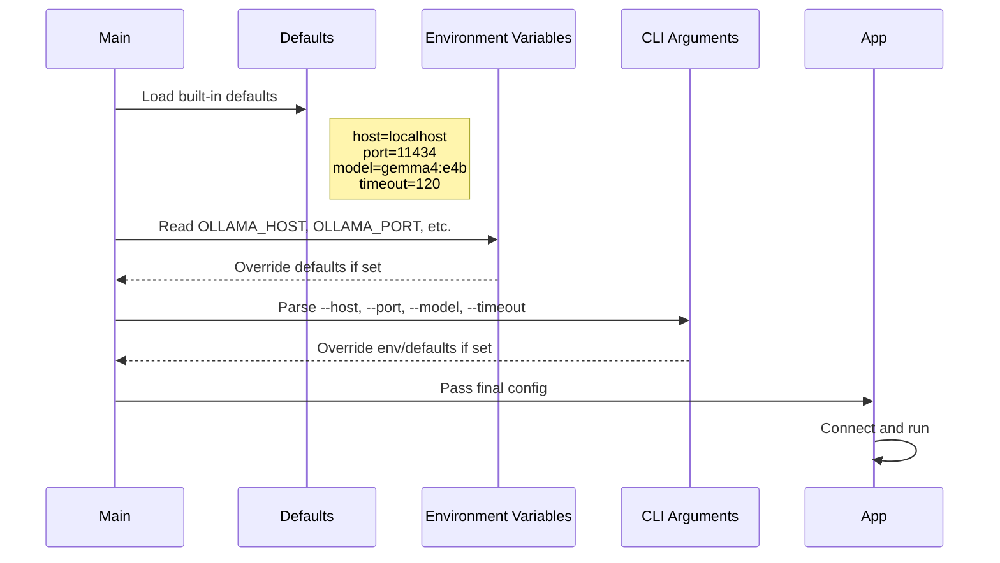

# ADR-004: Configuration Strategy

*Status*: Accepted · *Date*: 2026-04-10 · *Context*: The application had hardcoded values for host, port, model, and timeout. This is an anti-pattern that prevents different setups without recompiling and makes testing harder.

## Options Considered

| Option | Pros | Cons |
|--------|------|------|
| CLI arguments only | Simple, unix-way | Verbose when many options |
| Environment variables only | Simple, 12-factor style | Not visible, easy to forget |
| Config file (JSON/YAML) | Persistent, clear overview | Extra parsing dependency |
| **Env vars + CLI args** | Flexible, layered | Slightly more code |

## Decision

Environment variables are used as the base configuration, with CLI arguments as overrides.

### Precedence (highest wins)

1. CLI arguments (`--host`, `--model`, etc.)
2. Environment variables (`OLLAMA_HOST`, `OLLAMA_MODEL`, etc.)
3. Built-in defaults

### Configuration

| Setting | CLI arg | Short | Env var | Default |
|---------|---------|-------|---------|---------|
| Host | `--host` | `-h` | `OLLAMA_HOST` | `localhost` |
| Port | `--port` | `-p` | `OLLAMA_PORT` | `11434` |
| Model | `--model` | `-m` | `OLLAMA_MODEL` | `gemma4:e4b` |
| Timeout | `--timeout` | `-t` | `OLLAMA_TIMEOUT` | `120` |

### Examples

```bash
# All defaults
./build/llama-cli

# Override model via env
OLLAMA_MODEL=gemma4:26b ./build/llama-cli

# Override host via CLI (takes precedence over env)
OLLAMA_HOST=192.168.1.10 ./build/llama-cli --host=localhost
```

## Design



## Rationale

- Env vars align with Ollama's own `OLLAMA_HOST` convention
- [12-factor app](https://12factor.net/config) factor III is followed: config is stored in the environment
- CLI args are a pragmatic addition — 12-factor targets web services, but for CLI tools `--host=x` is more natural than `OLLAMA_HOST=x`
- Built-in defaults ensure it works out of the box with a standard Ollama install
- Defaults must live somewhere — the anti-pattern was not having a way to override them, not their existence (SOLID: Open/Closed principle)
- No config file dependency is introduced — the project stays lean

## Consequences

- `argv` is parsed manually (no external library — `getopt` or manual parsing is used)
- Env vars are read via `std::getenv`
- The prompt remains hardcoded for now — it will become interactive input (phase 2)
