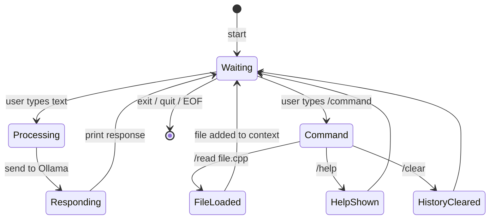
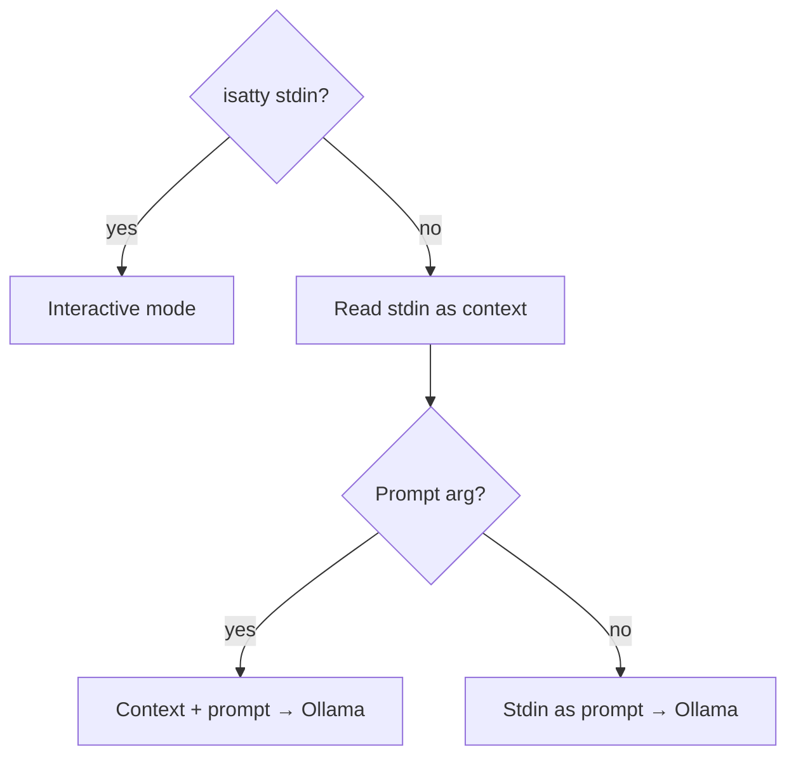

# ADR-013: File Reading & REPL Commands

*Status*: Accepted · *Date*: 2026-04-10 · *Context*: Users need to provide file contents as context to the LLM. This must work in both sync mode (pipe) and interactive mode (commands). A command system for the REPL is needed.

## Decision

### Sync mode — stdin pipe (ADR-007)
Piped stdin is prepended as context to the prompt argument:

```bash
cat main.cpp | llama-cli "review this code"
```

### Interactive mode — slash commands
Commands start with `/` and are handled by the REPL, not sent to the LLM:

```
> /read main.cpp
[loaded main.cpp — 25 lines]
> review this code
...
> /read test.cpp
[loaded test.cpp — 40 lines]
> compare the implementation with the tests
```

### REPL interaction model



### Command reference

| Command | Description |
|---------|-------------|
| `/read <file>` | Load file contents into conversation context |
| `/help` | Show available commands |
| `/clear` | Clear conversation history |
| `exit` / `quit` | Exit the REPL |

### How /read works
1. File contents are read from disk
2. A user message is added to history: `[file: main.cpp]\n<contents>`
3. The file is now part of the conversation context
4. Subsequent prompts can reference the file

### Pipe detection (sync mode)



## Rationale
- Slash commands follow IRC/Discord/Slack convention — universally understood
- `/read` is explicit — no ambiguity about what's a file vs a prompt
- Pipe support follows POSIX conventions (ADR-007)
- Commands are extensible — `/write`, `/run` can be added later
- `/clear` is essential as conversation history grows and slows down responses

## Consequences
- REPL needs a command parser (check if line starts with `/`)
- File I/O is added as a dependency (just `std::ifstream`)
- Large files may exceed model context window — no truncation for now
