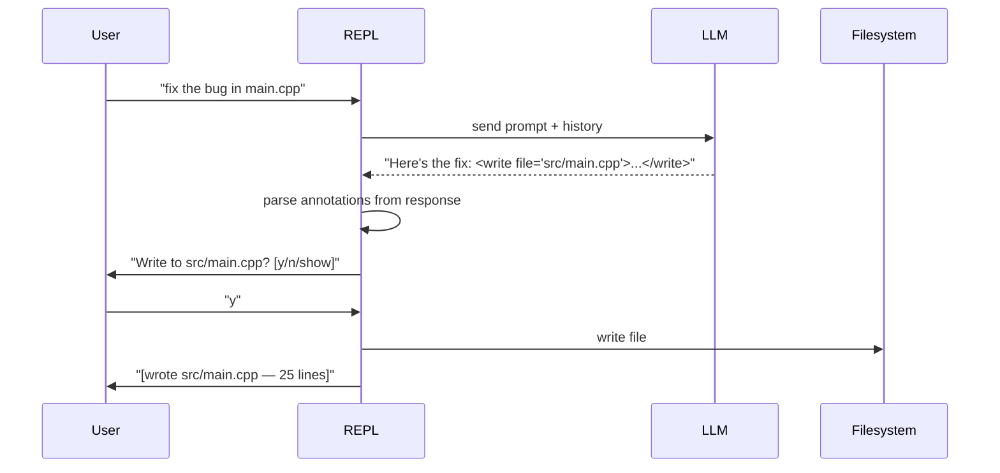

# ADR-014: LLM Tool Annotations

*Status*: Proposed · *Date*: 2026-04-10 · *Context*: The LLM needs to be able to propose file writes and command execution. Rather than implementing full tool-calling (which requires model support), annotations in the LLM's response are parsed by the client and executed after user confirmation.

## Decision

The LLM is instructed via the system prompt to use XML-style annotations when it wants to perform actions. The client parses these from the response and prompts the user for confirmation.

### Annotations

| Annotation | Purpose | Example |
|------------|---------|---------|
| `<write file="path">content</write>` | Write or create a file | `<write file="src/main.cpp">...</write>` |
| `<str_replace path="path"><old>...</old><new>...</new></str_replace>` | Targeted edit in existing file | See below |
| `<read path="path" lines="1-20"/>` | Read specific lines from a file | `<read path="config.h" lines="1-50"/>` |
| `<read path="path" search="term"/>` | Search for a term in a file | `<read path="repl.cpp" search="confirm"/>` |
| `<read path="path"/>` | Read entire file | `<read path="config.h"/>` |
| `<exec>command</exec>` | Execute a shell command | `<exec>make test</exec>` |

### Flow



### User confirmation

| Action | Prompt | Options |
|--------|--------|---------|
| `<write>` (existing file) | Auto-diff shown, then `Write to path? [y/n/s]` | y/n/s |
| `<write>` (new file) | Content shown, then `Write to path? [y/n/s]` | y/n/s |
| `<str_replace>` | Diff of old→new shown, then `Apply str_replace to path? [y/n]` | y/n |
| `<exec>` | `Run: command? [y/n]` | y/n |
| `<read>` | No confirmation — content injected automatically | — |

### System prompt addition

The system prompt is extended to instruct the LLM about available annotations:

```text
When you want to write a file, wrap the content in <write file="path">content</write>.
When you want to run a command, wrap it in <exec>command</exec>.
When you need to read a file, use <read path="path"/>.
The user will be asked to confirm before any action is executed.
Do not use annotations unless the user asks you to create, modify, or run something.
```

### Parsing rules

- Annotations are extracted from the response text after receiving it
- The response text is displayed to the user with annotations replaced by a summary (e.g. `[proposed: write src/main.cpp]`)
- Multiple annotations in one response are processed sequentially
- If the LLM outputs malformed annotations, they are shown as plain text

## Rationale

- No model tool-calling support needed — works with any LLM via prompt engineering
- User always confirms before any action — safe by default
- XML-style tags are unambiguous and easy to parse
- Same pattern used by Claude Code, Kiro, and aider
- Extensible — new annotations can be added without changing the protocol

## Consequences

- An annotation parser is needed (regex or simple state machine)
- System prompt grows — may reduce available context for conversation
- LLM may not always use annotations correctly — graceful fallback to plain text
- `<read>` annotations create a feedback loop: LLM asks for file → client reads → sends back → LLM continues
