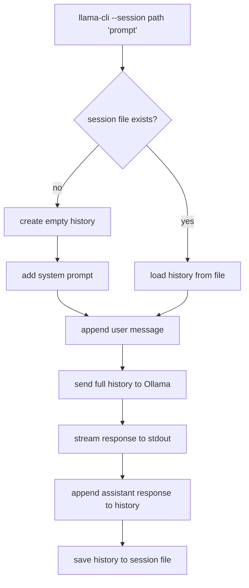
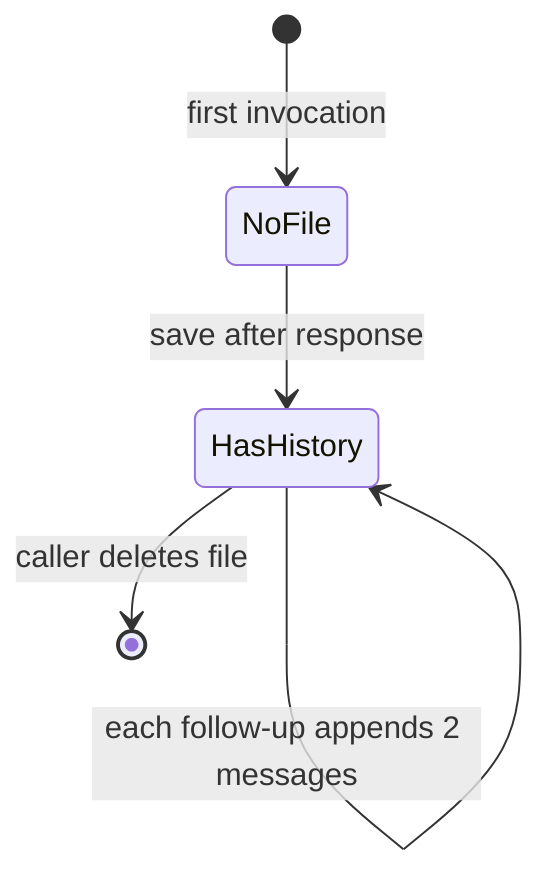
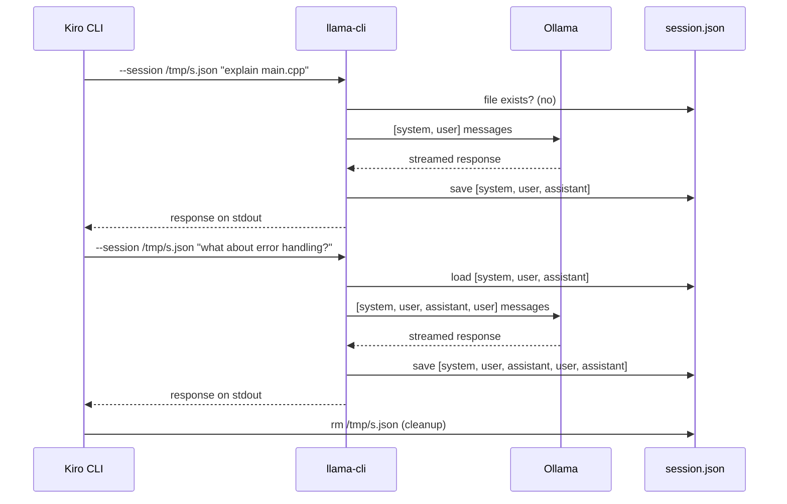
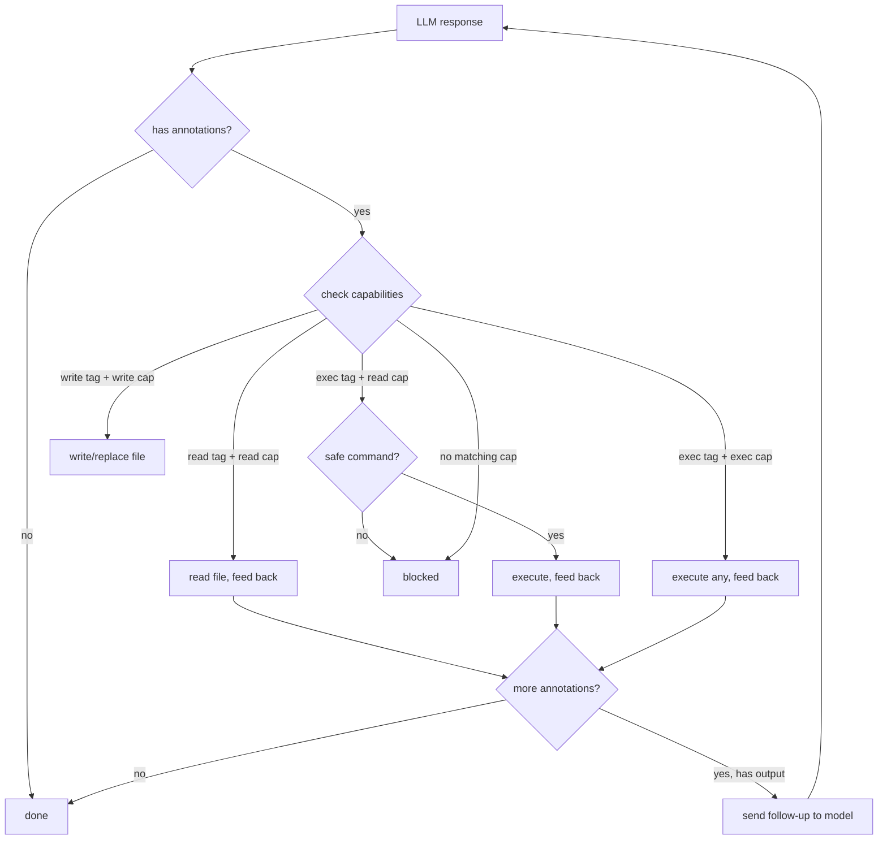
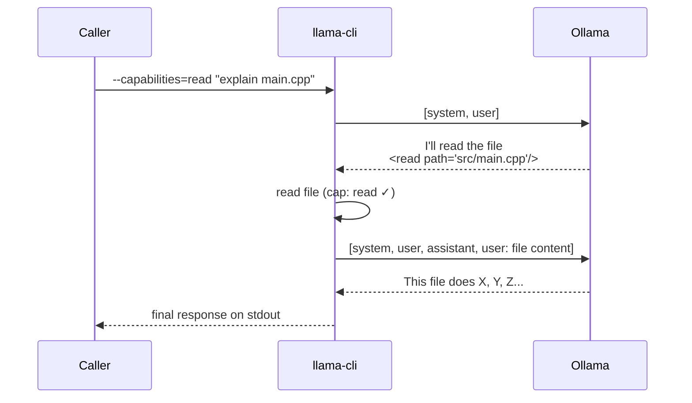

# ADR-056: Stateful Sync Mode via `--session`

*Status*: Implemented · *Date*: 2026-04-24 · *Context*: External tools (Kiro CLI, scripts, CI pipelines) use sync mode for one-shot queries but cannot hold multi-turn conversations because sync mode discards history after each call. This blocks delegation patterns where an orchestrator needs follow-up capability.

## Problem

```bash
# First question works fine
./llama-cli "what is the eisenhower matrix?"

# Follow-up has no context — LLM doesn't know what "it" refers to
./llama-cli "give me examples for each quadrant"
```

Sync mode is stateless by design (ADR-005). Each invocation builds a fresh `vector<Message>`, sends it to Ollama, and exits. There is no mechanism to carry conversation history across invocations.

## Decision

Add a `--session PATH` flag that persists conversation history to a JSON file between sync invocations.

### Usage

```bash
# First call — creates session file, sends system prompt + user message
./llama-cli --session /tmp/chat.json "what is the eisenhower matrix?"

# Follow-up — loads history from file, appends new message, full context sent
./llama-cli --session /tmp/chat.json "give me examples for each quadrant"

# Combine with --files for context-aware follow-ups
./llama-cli --session /tmp/review.json --files src/main.cpp "review this code"
./llama-cli --session /tmp/review.json "now focus on error handling"

# Inspect the conversation
cat /tmp/chat.json

# Clean up when done
rm /tmp/chat.json
```

### Flow



### Session file format

The file is a JSON array of message objects — the same structure used internally by `ollama_chat()`:

```json
[
  {"role":"system","content":"You are llama-cli, a local AI assistant..."},
  {"role":"user","content":"what is the eisenhower matrix?"},
  {"role":"assistant","content":"The Eisenhower Matrix helps prioritize..."},
  {"role":"user","content":"give me examples for each quadrant"},
  {"role":"assistant","content":"Sure, here are examples..."}
]
```

### State diagram



### Interaction with other flags

| `--session` | `--files` | Stdin | Behavior |
|-------------|-----------|-------|----------|
| — | — | prompt | One-shot sync (unchanged) |
| PATH | — | prompt | Stateful sync: load/save history |
| PATH | files | prompt | Stateful sync: file context + prompt appended |
| — | files | prompt | One-shot with file context (unchanged, ADR-030) |
| PATH | — | — | Error: no prompt provided |

### Sequence: orchestrator using `--session`



### Implementation

**config.h** — add field:

```cpp
std::string session_path;  ///< Session file for multi-turn sync (--session, ADR-056)
```

**config.cpp** — add to `opts[]` table (reuses existing `match_string_opts` machinery):

```cpp
{"--session=", nullptr, &Config::session_path},
```

**main.cpp** — session helpers + sync mode wiring:

```cpp
// Load: read messages from JSON file (empty vector if file doesn't exist)
static std::vector<Message> load_session(const std::string& path);

// Save: write messages array to JSON file
static void save_session(const std::string& path, const std::vector<Message>& msgs);

// In sync mode:
std::vector<Message> messages = cfg.session_path.empty()
    ? std::vector<Message>{}
    : load_session(cfg.session_path);

// System prompt only on first turn (not already in history)
if (messages.empty() && !cfg.system_prompt.empty()) {
  messages.push_back({"system", cfg.system_prompt});
}
messages.push_back({"user", cfg.prompt});

// ... send to Ollama, get response ...

if (!cfg.session_path.empty()) {
  messages.push_back({"assistant", response});
  save_session(cfg.session_path, messages);
}
```

### JSON parsing approach

Reuses `json_extract_string()` from `json/json.h` for reading. Serialization uses a minimal `escape_json()` helper in main.cpp — same escape logic as `ollama.cpp` but kept local to avoid coupling.

## Alternatives considered

| Alternative | Why rejected |
|-------------|-------------|
| Generated session ID | Requires state management, lookup table, cleanup daemon |
| SQLite database | Overkill for a conversation log |
| Append-only JSONL | Simpler writes but harder to parse as messages array |
| Shared memory / socket | Adds IPC complexity, breaks the stateless CLI model |
| Keep REPL running in background | Needs process management, TTY allocation |

## Why a file path, not a generated ID

- No server component needed — llama-cli stays stateless
- The caller controls where the file lives and when to delete it
- Easy to inspect and debug — it's just JSON
- Multiple parallel sessions are trivial — different file paths
- Works in CI, scripts, containers — anywhere with a filesystem

## Consequences

- Sync mode gains multi-turn capability with zero architectural change
- ~70 lines added to main.cpp (helpers + wiring)
- Session files grow unbounded — caller is responsible for cleanup or rotation
- No built-in context window management — if history exceeds model context, Ollama truncates
- Future: could add `--session-clear` to reset, or `--session-last N` to limit history depth

## Capabilities: `--capabilities=read,write,exec`

Without capabilities, sync mode streams the raw LLM response (including annotation tags) to stdout and the caller handles them. With `--capabilities`, llama-cli processes annotations itself — auto-executing allowed actions and feeding output back to the model.

### Capability levels

| Capability | Annotations processed | Auto-executes |
|------------|----------------------|---------------|
| `read` | `<read>`, `<exec>` (safe commands only) | File reads, read-only shell commands |
| `write` | `<write>`, `<str_replace>` | File creates and edits |
| `exec` | `<exec>` (any command) | Arbitrary shell commands |

Capabilities are additive and comma-separated:

```bash
# Research mode — model can read files and run safe commands
./llama-cli --session s.json --capabilities=read "what does main.cpp do?"

# Code fix mode — model can read and edit files
./llama-cli --session s.json --capabilities=read,write "fix the bug in config.cpp"

# Full autonomy — model can do anything (explicit opt-in)
./llama-cli --session s.json --capabilities=read,write,exec "set up the project"
```

### Read-only command allowlist

The `read` capability allows `<exec>` only for commands whose first word is in this allowlist:

```text
cat ls find grep head tail wc stat tree du df
file diff sort uniq awk sed less more realpath dirname basename
```

Safety rules:

- Each pipe segment is checked independently (`cat foo | grep bar` → both OK)
- Redirects (`>`, `>>`) are always blocked in read mode
- Commands not in the allowlist require the `exec` capability

### Capability flow



### Follow-up loop

When read/exec output is produced, it's fed back to the model as a user message so the model can analyze the results. This loops up to 10 rounds (safety limit) or until the model produces a response with no actionable annotations.


