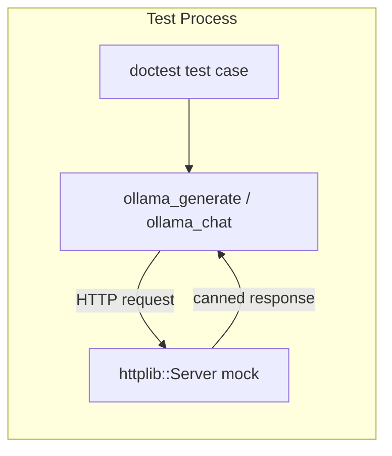
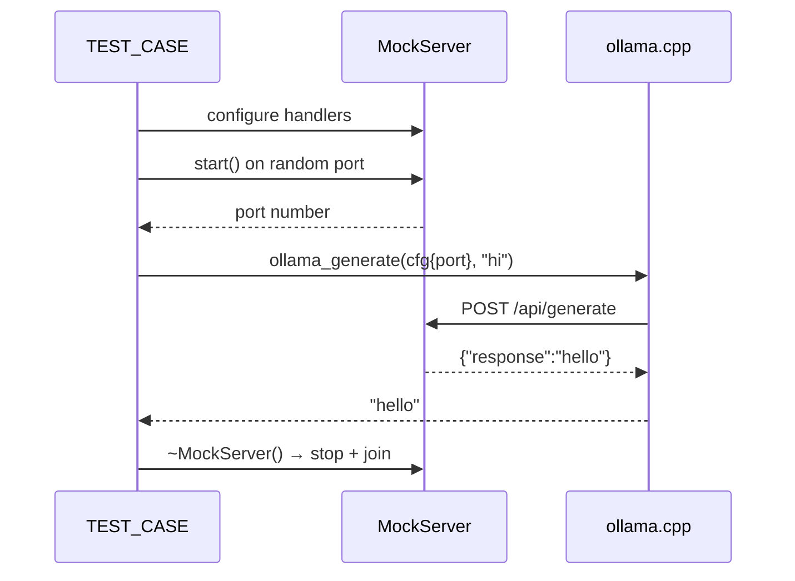

## Status

Implemented

## Context

`ollama.cpp` was at **0% test coverage** — the single largest gap in the codebase (205 lines). Testing it required HTTP calls to a running Ollama server, making unit tests impossible without a mock.

We needed a solution that:

1. Requires **no new dependencies** — the project avoids unnecessary abstractions (CONTRIBUTING.md)
2. Runs **in-process** — no external processes, no port conflicts in CI
3. Covers **all code paths** — success, HTTP errors, connection failures, streaming
4. Is **fast** — no real network latency, no model loading

## Decision

Use `httplib::Server` (already bundled via cpp-httplib) as an in-process mock Ollama server in unit tests.

### Architecture



### Test lifecycle



### MockServer RAII wrapper

```cpp
struct MockServer {
  httplib::Server svr;
  std::thread thr;
  int port = 0;

  void start() {
    port = svr.bind_to_any_port("127.0.0.1");
    thr = std::thread([this]() { svr.listen_after_bind(); });
    while (!svr.is_running()) {
      std::this_thread::sleep_for(std::chrono::milliseconds(1));
    }
  }

  ~MockServer() {
    svr.stop();
    if (thr.joinable()) thr.join();
  }
};
```

Key design choices:

- **`bind_to_any_port`** — OS picks a free port, no conflicts in parallel CI
- **RAII destructor** — server always stops, even on test failure
- **Joinable thread** — no detached threads, clean shutdown

## Motivation

### Why not a mock framework (GMock, FakeIt)?

- Adds a dependency for one file
- Requires refactoring `ollama.cpp` to use virtual interfaces
- Over-engineering for 4 free functions

### Why not a real Ollama instance?

- Requires GPU/model in CI — slow, expensive, flaky
- Can't test error paths (connection failure, HTTP 500)
- Already covered by `make live` for integration testing

### Why not dependency injection / virtual interface?

- `ollama.cpp` exposes 4 free functions, not a class
- The REPL already uses `ChatFn` callback for testability
- Adding an interface just for testing violates "simple C++" principle

### Why httplib::Server specifically?

- **Already a dependency** — zero cost to add
- **Same library as production** — no impedance mismatch
- **Supports all needed features** — GET, POST, streaming, custom status codes

## Coverage impact

| File | Before | After | Delta |
|------|--------|-------|-------|
| `ollama.cpp` | 0% | ~80% | +164 lines |
| **Total project** | 52.7% | ~60% | +7.3% |

The remaining ~20% uncovered in `ollama.cpp` is the streaming retry path (requires timing-sensitive tests) and the `escape_json_string` control character branch.

## Consequences

### Positive

- Ollama client is now testable without a running server
- Connection failure and error paths are covered for the first time
- No new dependencies added
- Pattern is reusable for future HTTP client tests

### Negative

- Connection failure tests take ~3s each (due to production retry logic)
- `httplib::Server` threading adds minor complexity to test setup
- macOS gcov produces noisy warnings (harmless, CI on Linux is clean)

## Test matrix

| Function | Happy path | HTTP error | Connection failure | Trace mode |
|----------|-----------|------------|-------------------|------------|
| `ollama_generate` | ✅ | ✅ (with/without error field) | ✅ | ✅ |
| `ollama_chat` | ✅ | ✅ | ✅ | ✅ |
| `ollama_chat_stream` | ✅ (token collection) | ✅ | ✅ (with retry) | — |
| `get_available_models` | ✅ | ✅ (bad response) | ✅ | — |
