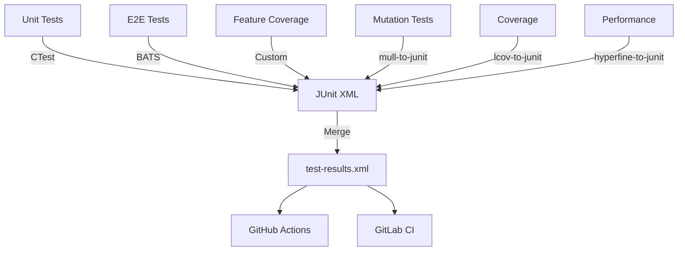

summary: Unified test reporting with JUnit XML across all test types, enabling better performance and developer productivity.

# ADR-106: Unified Test Reporting & Performance

## Context

The project has multiple test types with inconsistent reporting:

| Test Type | Count | Duration | Format | CI Integration |
|-----------|-------|----------|--------|----------------|
| Unit tests (doctest) | 347 scenarios | ~90s | Custom script | ✗ No structured output |
| E2E tests (bash) | 13 scripts | ~45s | BATS-like | ✗ No JUnit XML |
| Feature coverage | 49 features | ~5s | Custom | ✗ No structured output |
| Mutation tests (Mull) | ~500 mutants | ~15min | JSON | ⚠ Manual parsing |
| Coverage (lcov) | - | ~2min | HTML/lcov | ⚠ No JUnit format |

**Problems:**

1. No unified reporting format (JUnit XML)
2. Slow sequential execution (unit tests: 90s)
3. CI can't parse test results natively
4. No performance benchmarks
5. Manual aggregation of test results

**GitHub Actions Support:**

- ✓ Native JUnit XML parsing
- ✓ Test result annotations on PRs
- ✓ Trend graphs over time
- ✓ Flaky test detection

**GitLab Support:**

- ✓ JUnit XML via `artifacts:reports:junit`
- ✓ Test summary in merge requests
- ✓ Test failure tracking

## Problem

Slow test execution impacts developer productivity:

- Pre-commit hook takes >1 minute (developers skip it)
- TDD cycle is disrupted (build → test → refactor loop too slow)
- CI feedback is faster than local testing (wrong incentive)

## Decision

Implement unified test reporting with JUnit XML across all test types, plus parallel execution for performance.

### 1. Unit Tests → CTest + JUnit XML

```cmake
enable_testing()
foreach(test_bin ${TEST_BINARIES})
  add_test(NAME ${test_name} COMMAND ${test_bin})
endforeach()
```

```bash
ctest --test-dir build -j $(nproc) --output-junit unit-tests.xml
```

### 2. E2E Tests → BATS with JUnit

Convert bash tests to BATS format for structured output:

```bash
# Current: custom bash scripts
bash e2e/test_foo.sh

# Proposed: BATS with JUnit formatter
bats --formatter junit e2e/*.bats > e2e-tests.xml
```

**BATS benefits:**

- TAP output (Test Anything Protocol)
- JUnit XML formatter
- Parallel execution (`--jobs`)
- Setup/teardown hooks

### 3. Feature Coverage → Custom JUnit

Generate JUnit XML from feature markers:

```bash
# scripts/test/check-feature-coverage.sh
echo '<?xml version="1.0"?>'
echo '<testsuite name="feature-coverage" tests="49" failures="0">'
for feature in $(grep -r "LOG_FEATURE" src/ | ...); do
  echo "  <testcase name=\"$feature\" time=\"0.001\"/>"
done
echo '</testsuite>'
```

### 4. Mutation Tests → Mull JSON → JUnit

Convert Mull's JSON output to JUnit XML:

```bash
# Parse mull-report.json and generate junit
python3 scripts/test/mull-to-junit.py mull-report.json > mutation-tests.xml
```

### 5. Coverage → lcov + JUnit Summary

Generate JUnit test case for coverage threshold:

```xml
<testsuite name="coverage" tests="1">
  <testcase name="line-coverage-threshold" time="2.5">
    <failure message="Coverage 58.2% below threshold 60%"/>
  </testcase>
</testsuite>
```

### 6. Performance Benchmarks (NEW)

Add performance regression tests:

```bash
# scripts/test/bench-performance.sh
hyperfine --export-json perf.json \
  './llama-cli --provider mock "hello"'

# Convert to JUnit
python3 scripts/test/perf-to-junit.py perf.json > perf-tests.xml
```

## Unified Reporting Architecture



### Makefile Integration

```makefile
test-all-junit: ## Run all tests and generate JUnit XML
	@mkdir -p .tmp/test-results
	@ctest --test-dir build -j $(nproc) --output-junit .tmp/test-results/unit.xml || true
	@bats --formatter junit e2e/*.bats > .tmp/test-results/e2e.xml || true
	@bash scripts/test/feature-coverage-junit.sh > .tmp/test-results/features.xml || true
	@bash scripts/test/coverage-junit.sh > .tmp/test-results/coverage.xml || true
	@python3 scripts/test/merge-junit.py .tmp/test-results/*.xml > test-results.xml
	@echo "✓ Generated test-results.xml ($(shell grep -c testcase test-results.xml) tests)"

test-unit-fast: ## Fast parallel unit tests
	@ctest --test-dir build -j $(nproc) --output-on-failure

test-unit-serial: ## Serial unit tests (for debugging)
	@bash scripts/test/run-unit.sh build
```

## Rationale

Fast tests enable:

- **TDD workflow**: sub-10s test cycles
- **Pre-commit hooks**: developers won't skip them
- **Rapid iteration**: build → test → refactor loop stays tight
- **CI parity**: local tests as fast as CI

Industry standard: unit tests should run in <10s for <1000 tests.

## Consequences

### Positive

- ✓ 4-8x faster test execution (90s → 10-20s)
- ✓ Industry-standard tooling (CTest)
- ✓ Better reporting (per-test timing, JUnit XML)
- ✓ CI integration (native GitHub Actions support)
- ✓ Maintains clear output and failure details
- ✓ Enables TDD workflow

### Negative

- ⚠ Requires CMake 3.20+ for best features
- ⚠ Migration effort (add `enable_testing()` to CMakeLists.txt)
- ⚠ Learning curve for CTest flags

### Risks

- **Flaky tests**: Parallel execution may expose race conditions
- **Resource contention**: Tests competing for file I/O
- **Mitigation**: `make test-unit-serial` for debugging

## Best Practices (from C++ Community)

### Google Test / LLVM

- Uses CTest with `--parallel` flag
- ~100k tests run in <5 minutes on CI
- Custom dashboard for test results

### Catch2 / Doctest

- Supports `--list-tests` for discovery
- Integrates with CTest via `catch_discover_tests()`
- Parallel execution via CTest

### Boost.Test

- Uses `b2` build system with `-j` flag
- Parallel test execution by default
- Structured XML output

**Common pattern:** All major C++ projects use CTest for parallel execution and reporting.

## Alternatives Considered

### 1. Test Sharding (rejected)

Split tests across multiple CI jobs. Adds complexity without helping local dev.

### 2. Test Caching (deferred)

Cache test results based on source hash. Requires infrastructure (ccache-like for tests).

### 3. Selective Test Execution (future)

Only run tests affected by changed files. Requires dependency graph analysis.

## References

- [CTest Documentation](https://cmake.org/cmake/help/latest/manual/ctest.1.html)
- [Google Test with CTest](https://google.github.io/googletest/advanced.html#running-test-programs-advanced-options)
- [LLVM Testing Infrastructure](https://llvm.org/docs/TestingGuide.html)
- [Catch2 CTest Integration](https://github.com/catchorg/Catch2/blob/devel/docs/cmake-integration.md)
- Current implementation: `scripts/test/run-unit.sh`
- CI parallel execution: `.github/workflows/ci.yml` (test job)

## Acceptance Criteria

### Performance

- [ ] Unit tests: 90s → <20s (4-8x speedup)
- [ ] E2E tests: maintain ~45s (already parallel)
- [ ] Total test suite: <3 minutes locally

### Reporting

- [ ] Single `test-results.xml` with all test types
- [ ] GitHub Actions displays test results natively
- [ ] Per-test timing and status
- [ ] Failure details preserved
- [ ] Summary: X/Y passed, Z failed, N skipped

### Coverage

- [ ] Unit tests: 347 scenarios → JUnit XML
- [ ] E2E tests: 13 scripts → JUnit XML
- [ ] Feature coverage: 49 features → JUnit XML
- [ ] Mutation tests: ~500 mutants → JUnit XML
- [ ] Coverage threshold: pass/fail → JUnit XML
- [ ] Performance benchmarks: NEW → JUnit XML

### Compatibility

- [ ] Works on macOS and Linux
- [ ] GitHub Actions integration
- [ ] GitLab CI compatible
- [ ] Fallback to serial execution (`make test-unit-serial`)
