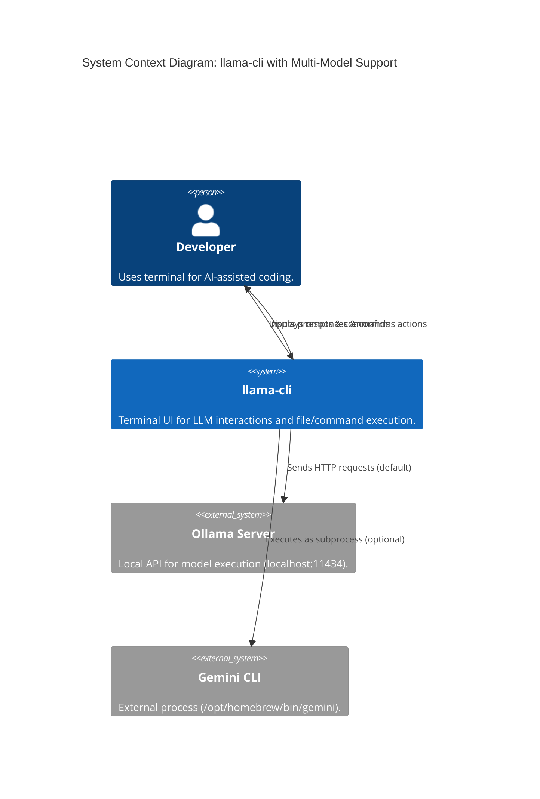
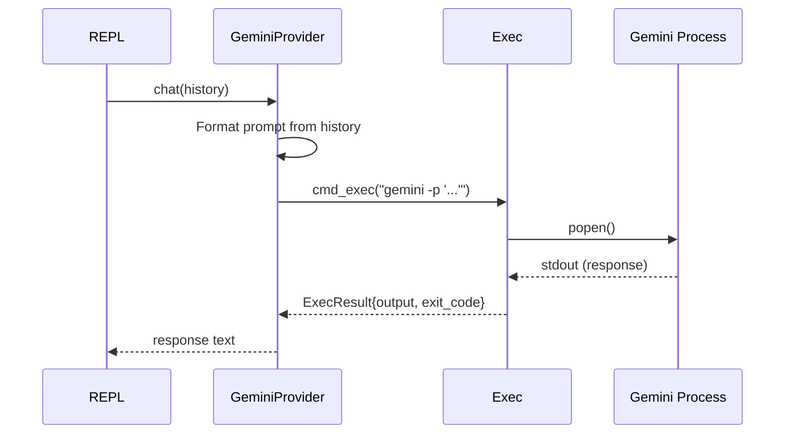

# Architecture V2: Multi-Model Provider System

This document detailed the structural changes made to support multiple LLM backends. It used the C4 model for visualization and explained core design patterns for junior developers.

## 1. System Context (C4 Level 1)

The system context was expanded to include the **Gemini CLI** as an optional external process.



## 2. Component Design (C4 Level 3)

We introduced a **Provider Abstraction Layer** to decouple the REPL from the specific backend.

```mermaid
C4Component
    title Component Diagram: Provider Abstraction Layer

    Container_Boundary(src, "llama-cli (C++)") {
        Component(repl, "REPL Loop", "repl.cpp", "Manages history and input dispatch.")
        Component(factory, "Provider Factory", "provider_factory.cpp", "Creates the selected provider based on Config.")

        ComponentInterface(iprovider, "LLMProvider (Interface)", "llm_provider.h", "Defines the chat(history) contract.")

        Component(ollama_p, "OllamaProvider", "ollama_provider.cpp", "Implements HTTP communication with Ollama.")
        Component(gemini_p, "GeminiProvider", "gemini_provider.cpp", "Implements CLI interaction via exec module.")

        Component(exec, "Exec Module", "exec.cpp", "Handles shell command execution with timeouts.")
    }

    Rel(repl, factory, "Requests provider")
    Rel(factory, ollama_p, "Instantiates")
    Rel(factory, gemini_p, "Instantiates")

    Rel(repl, iprovider, "Calls chat(history)")

    Rel(ollama_p, iprovider, "Implements")
    Rel(gemini_p, iprovider, "Implements")

    Rel(gemini_p, exec, "Uses to call 'gemini -p'")
```

## 3. The "Interface" Pattern Explained

For developers new to C++, an **Interface** (or Abstract Base Class) acted as a "contract."

* **The Contract**: We defined a class called `LLMProvider` that said: "Any class that wants to be a provider MUST have a method called `chat` that takes a conversation history and returns a string."
* **The Implementations**: `OllamaProvider` and `GeminiProvider` "signed" this contract. They did the work in different ways (HTTP vs. Shell), but the `REPL` didn't need to know that.
* **Polymorphism**: This allowed the `REPL` to hold a pointer to an `LLMProvider` without knowing *which* one it was. At runtime, the "Factory" decided which one to plug in.

## 4. Sequence: Calling Gemini

The sequence of events when using the Gemini provider was as follows:



This design ensured that the **REPL** remained clean and focused only on the user interface, while the complexity of different backends was hidden inside the providers.
