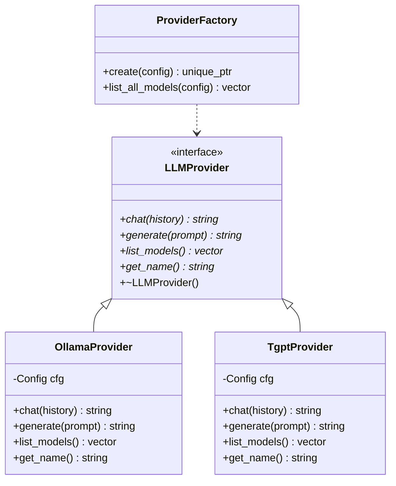

# Design: tgpt Provider Integration & /model Command

*Status*: Draft · *Date*: 2026-04-13 · *Author*: Gemini CLI

## Overview

This design implements the **Provider Abstraction Layer** described in ADR-020 and integrates `tgpt` as a secondary LLM provider. It also introduces the `/model` command to list and switch between available providers and models at runtime.

## Class Diagram

## /model Command Flow

1. **User Request**: User types `/model`.
2. **Model Listing**:
   - REPL calls `ProviderFactory::list_all_models()`.
   - `OllamaProvider` queries local Ollama API for models.
   - `TgptProvider` returns its hardcoded list of providers (e.g., `pollinations`, `openai`, `deepseek`).
3. **Display**: REPL displays a numbered list of all available models.
4. **Selection**: User types `/model <N>`.
5. **Switch**:
   - REPL identifies the provider and model name for index `<N>`.
   - REPL updates `cfg.provider` and `cfg.model`.
   - REPL recreates the active `LLMProvider` using the factory.

## Implementation Plan

### Iteration 1: Provider Abstraction & Ollama Refactor

- **Goal**: Introduce the interface and refactor existing Ollama logic without breaking functionality.
- **Files**:
  - `src/ollama/llm_provider.h`: Define `LLMProvider` interface.
  - `src/ollama/ollama_provider.h/cpp`: Concrete implementation for Ollama.
  - `src/ollama/provider_factory.h/cpp`: Factory for creating providers.
- **Changes**:
  - Update `src/main.cpp` and `src/repl/repl.cpp` to use the factory and interface.
- **Test**: `make test` must pass (Mock and Ollama modes).

### Iteration 2: Tgpt Provider Implementation

- **Goal**: Integrate `tgpt` as a CLI-based provider.
- **Files**:
  - `src/ollama/tgpt_provider.h/cpp`: Implement `LLMProvider` via `cmd_exec("tgpt -p ...")`.
- **Changes**:
  - Update `ProviderFactory` to support `tgpt`.
- **Test**: Unit test `TgptProviderTest` mocking `cmd_exec`.

### Iteration 3: /model Command & Runtime Switching

- **Goal**: Enable listing and switching providers/models via the REPL.
- **Changes**:
  - Add `list_models()` to `LLMProvider`.
  - Update `src/command/command.h/cpp` to parse `/model [arg]`.
  - Implement switching logic in `src/repl/repl.cpp`.
- **Test**: E2E test `e2e/test_model_command.sh`.

## Implementation Decision (v1.0)

For the initial implementation, we will stick to **Manual Selection**.

- The user explicitly chooses the provider/model via `/model`.
- This ensures predictability and keeps the codebase simple for C++ newcomers (per `CONTRIBUTING.md`).
- We will not implement automated session management or smart dispatching in this first phase.

## Future Considerations

The following ideas were identified during design review and may be implemented in future ADRs:

1. **Smart Dispatcher**: Using a fast, local model (e.g., Gemma via Ollama) to analyze prompts and automatically route them to the most suitable provider (e.g., `tgpt` for general queries, `gemini` for complex coding).
2. **Cost & Token Management**: Adding `is_free()`, `cost_per_token()`, and `remaining_credits()` to the `LLMProvider` interface to help users manage their usage of paid APIs.
3. **Provider Specialties**: Tagging providers with specialties (e.g., "coding", "fast", "creative") to assist in manual or automatic selection.
4. **Persistent Sessions**: Moving from one-shot CLI execution to long-running sessions or direct API library integration for lower latency.

## Acceptance Criteria

- [ ] `LLMProvider` interface exists and is used by `REPL`.
- [ ] `OllamaProvider` and `TgptProvider` implement the interface.
- [ ] `/model` lists models from both providers.
- [ ] `/model <N>` successfully switches the active provider/model.
- [ ] `tgpt` integration is verified via automated tests.
- [ ] Documentation is updated with new command usage.
