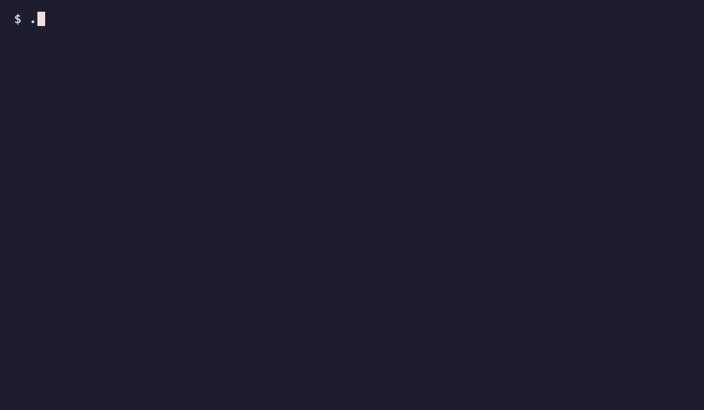
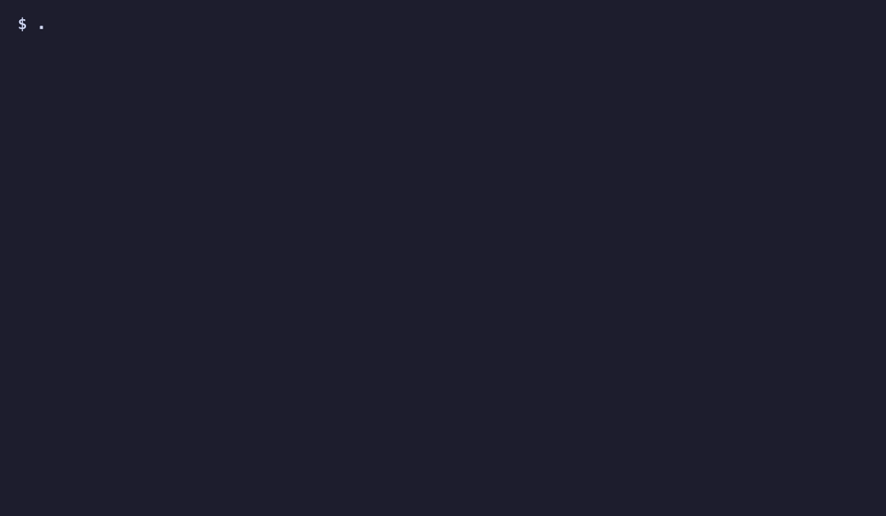
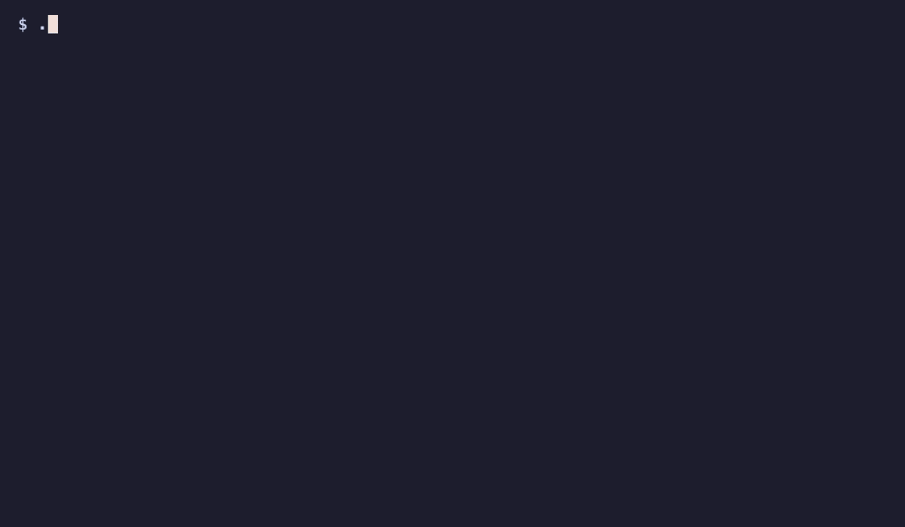

# Feature Demos

All demos use scripted mock responses for reproducible, realistic recordings.

## Full Tour

Everything in one gif: help, chat, agents, themes, exec, sessions.

## Commands

`/help`, `/version`, `/usage`, `/set` — the basics.

## Chat

Streaming chat, `/rate`, `/agent`, `/theme`, `/nick`.

## Session Management

`/chat save`/`load`, `/clear`, `/compress`, `/provider`, `/mem`, `/pref`.

## Themes & Colors

`/theme` switches between dark, hacker, light, mono. `/color` customizes individual roles.

## File Operations

`!!cmd` (pipe to LLM), `!cmd` (run inline), file context.

## Recording

Demos are recorded with [VHS](https://github.com/charmbracelet/vhs) using `make record-e2e`. Tapes live in `demos/tapes/`.
