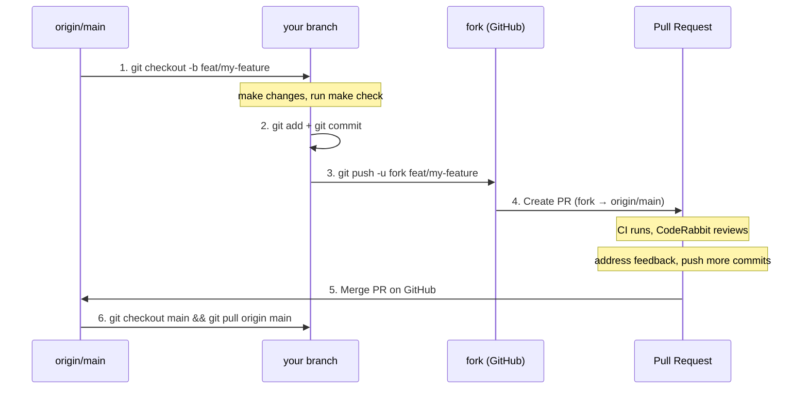
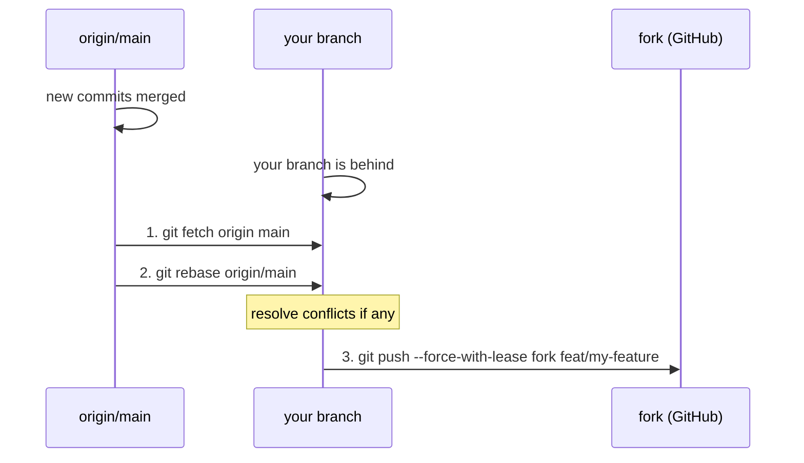
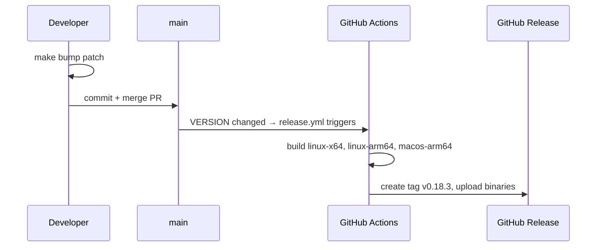

# Pull Request & Release Workflow

This guide covers the fork-based contribution workflow used in this project.

## Setup (one-time)

```bash
# Clone the upstream repo
git clone git@github.com:rkristelijn/llama-cli.git
cd llama-cli

# Add your fork as a remote
git remote add fork git@github.com:<your-user>/llama-cli.git
```

Verify:

```text
$ git remote -v
origin  git@github.com:rkristelijn/llama-cli.git   # upstream (read)
fork    git@github.com:<your-user>/llama-cli.git    # your fork (push)
```

## Workflow overview



## Step by step

### 1. Create a feature branch

Always branch from an up-to-date main:

```bash
git checkout main
git pull origin main
git checkout -b feat/my-feature    # or fix/, refactor/, docs/
```

### 2. Make changes and verify

```bash
# edit files...
make check                         # runs all 15 quality checks
```

### 3. Commit

```bash
git add src/file.cpp src/file.h    # stage specific files, avoid git add .
git commit -m "feat: add banner toggle option"
```

Commit message format: `type: short description`
Types: `feat`, `fix`, `refactor`, `docs`, `chore`, `test`

### 4. Push to your fork

```bash
git push -u fork feat/my-feature
```

> **Important**: push to `fork`, not `origin`. Origin is the upstream repo.

### 5. Create the PR

```bash
# Using GitHub CLI:
gh pr create --repo rkristelijn/llama-cli --base main --head <your-user>:feat/my-feature

# Or use the GitHub web UI — it will suggest creating a PR after you push.
```

### 6. Address review feedback

Push additional commits to the same branch:

```bash
# make fixes...
git add -p                         # stage interactively
git commit -m "fix: address review feedback"
git push fork feat/my-feature
```

The PR updates automatically.

## Rebasing when your branch is behind main

This happens when main has new commits that your branch doesn't have.



```bash
git fetch origin main
git rebase origin/main
# resolve any conflicts, then: git rebase --continue
git push --force-with-lease fork feat/my-feature
```

> `--force-with-lease` is required after rebase (history was rewritten).
> It's safe: it refuses if someone else pushed to your branch.

## Releasing

Releases are automated. When `VERSION` is changed on `main`, the release workflow triggers.



```bash
make bump patch                    # 0.18.2 → 0.18.3 (also: minor, major)
git add VERSION
git commit -m "chore(version): bump"
# push via PR as usual
```

**VERSION format**: plain semver without `v` prefix (e.g. `0.18.3`).
The release workflow adds the `v` prefix for tags and release names (`v0.18.3`).

## Quick reference

| Task | Command |
|------|---------|
| Update main | `git pull origin main` |
| New branch | `git checkout -b feat/name` |
| Push to fork | `git push -u fork feat/name` |
| Rebase on main | `git fetch origin main && git rebase origin/main` |
| Force push after rebase | `git push --force-with-lease fork feat/name` |
| Run checks | `make check` |
| Bump version | `make bump patch\|minor\|major` |
| Create PR | `gh pr create --repo rkristelijn/llama-cli` |

## Common mistakes

- **Pushing to origin instead of fork** — you'll get permission denied or push to upstream by accident
- **`git pull` after rebase** — creates merge commits; use `git push --force-with-lease` instead
- **Editing VERSION manually** — can introduce trailing whitespace or extra newlines that break the build; use `make bump`
- **Forgetting to rebase** — your PR will have merge conflicts; rebase before requesting review
